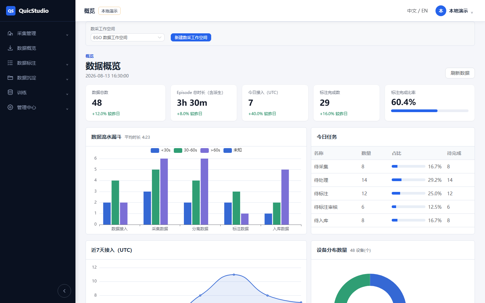
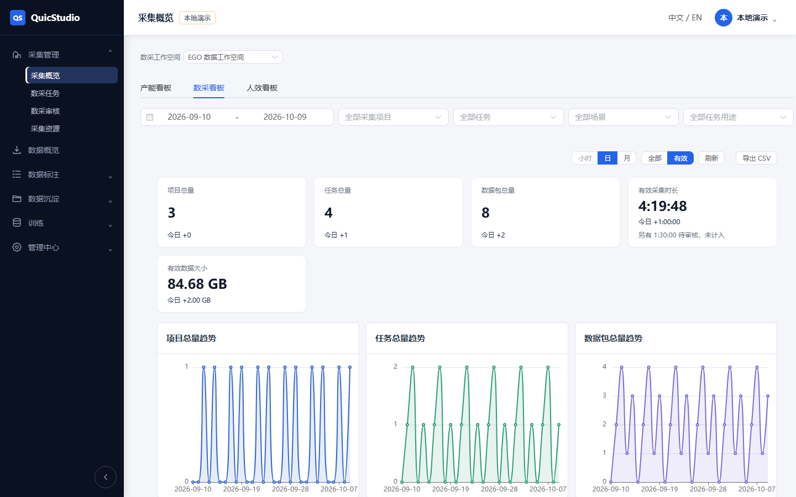
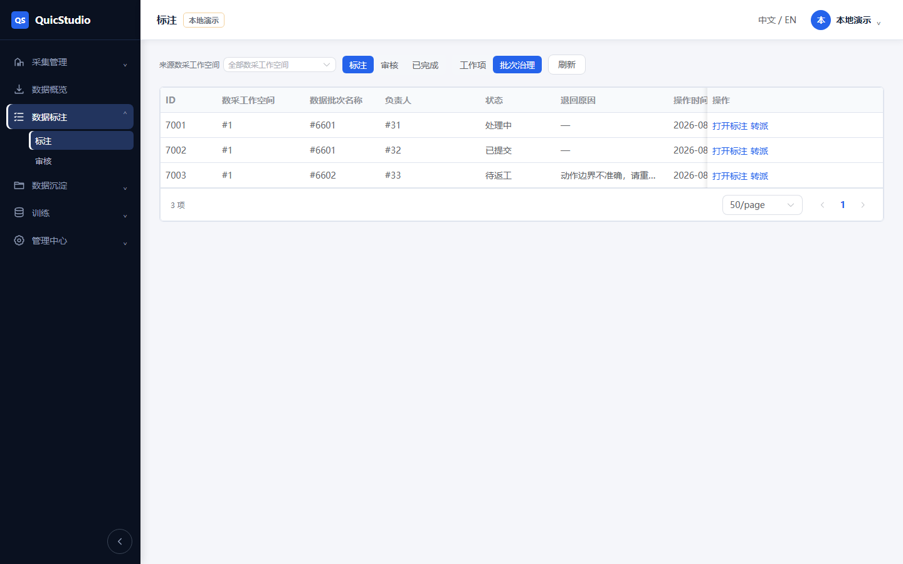
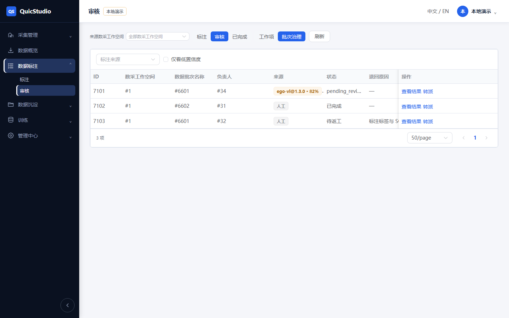
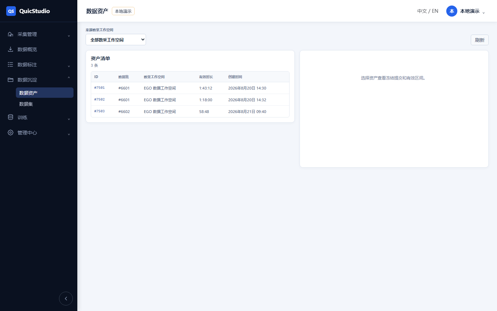
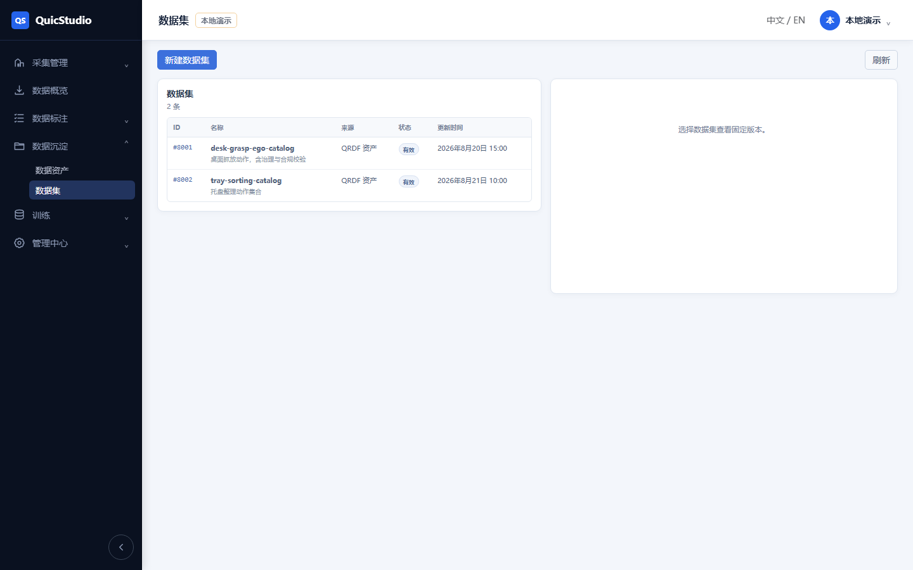
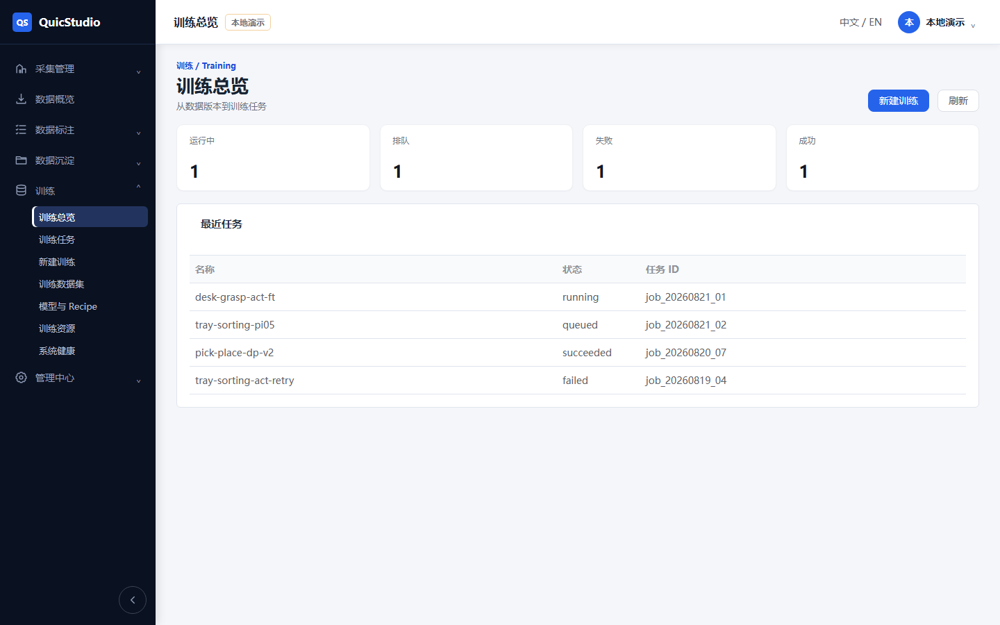
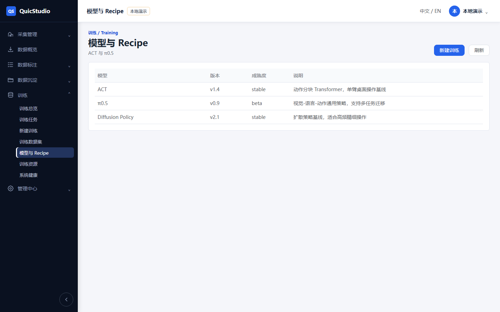
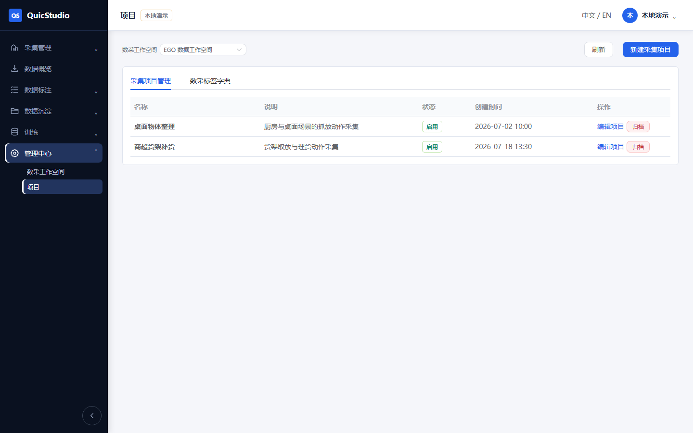

# Embodied AI Data Processing Platform v2.0

> 具身智能数据平台：**data-engine（算子引擎）+ studio（数据/训练工作台）**，Windows 双击即用。

## 平台预览

### 数据概览（Dashboard）


### 采集概览（数采流水 / 图表）


### 标注工作台


### 审核工作台


### 数据资产


### 数据集


### 训练总览


### 模型与 Recipe


### 项目管理


## 这是什么

| 模块 | 说明 |
|---|---|
| `data-engine/` | 底层数据处理算子引擎（Python SDK）。含 `sync` / `clean` / `compliance` / `perception` / `label` / `export` 六大算子库，统一 `list_capabilities()` / `invoke()` 调度。 |
| `studio/` | 数据 / 训练工作台。前端 Vue + Element Plus，后端 FastAPI（alpha）。 |
| `启动studio.cmd` | Windows 一键启动器（双击即用，路径自适配）。 |

### 功能模块（studio）

- **采集管理**：采集概览 / 数采任务 / 数采审核 / 采集资源
- **数据标注**：标注工作台 / 审核工作台
- **数据沉淀**：数据资产 / 数据集
- **训练**：训练总览 / 训练任务 / 新建训练 / 训练数据集 / 模型与 Recipe / 训练资源 / 系统健康
- **管理中心**：数采工作空间 / 项目

### 数据流

```
原始采集数据
   → data-engine 算子（sync / clean / compliance / perception / label / export）
   → studio 编排 + 质检 + 建批 + 人员分配
   → 标准数据集（RLDS / QRDF）
   → 训练机器人策略模型
```

## 快速开始

1. 克隆仓库：
   ```bash
   git clone https://github.com/MAHONGHAO1/Embodied-AI-Data-Processing-Platform.git
   ```
2. 进入文件夹，**双击 `启动studio.cmd`**
3. 自动启动前端服务并打开浏览器 → `http://127.0.0.1:8090/?demo=1`
4. `?demo=1` 为纯前端演示模式（内存 mock 数据），无需后端 / 数据库，上述所有控制台均可点击浏览。

停止：关闭最小化的 `QuicStudio-Frontend` 窗口即可。

## 备注

- `data-engine/perception/weights/YOLO/detector.onnx`（约 102MB）因 GitHub 单文件 100MB 限制未纳入仓库。它仅用于 `data-engine` 的感知算子，前端演示不需要；如需启用感知能力请另行获取该权重。
- 后端（PostgreSQL / Redis / MinIO + 训练域）仍为 alpha，裸 Windows 无法一键起；当前启动器走纯前端演示模式。
- v0.4 旧内容已移除，本仓库当前即 v2.0。

## License

见各子目录自带 LICENSE。
